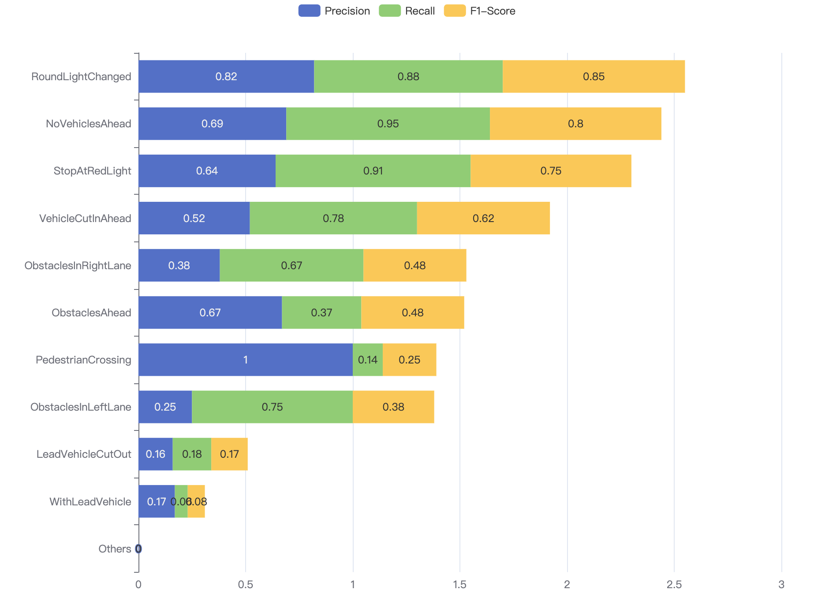

# 🚘 Multimodal Video-Text Understanding for Autonomous Driving

A research project exploring video-text retrieval and understanding in autonomous driving scenarios using advanced multimodal models, fine-tuning strategies, and innovative annotation techniques.

## 📌 Project Overview

Autonomous driving systems generate large volumes of video data. However, only a small fraction of these contain safety-critical scenarios (e.g., overtaking, pedestrian crossings, emergency stops). This project aims to develop effective video-text retrieval and understanding models tailored to autonomous driving, facilitating the rapid identification of such events.

## 🎯 Goals

- Improve video-text retrieval accuracy on autonomous driving datasets.
- Explore human-annotated and automatic video captioning methods.
- Design multi-round reasoning and fine-tuning pipelines.
- Implement knowledge distillation to compress large models for efficient deployment.

## 🎖️ Workflow

  

The workflow begins with raw driving data (>1,700 video clips) collected from front-view cameras, split into training and validation sets. Each clip is annotated using three-level labels, either by manual labeling or automatic generation.

From the labeled data, captions are generated to describe driving scenarios. In parallel, multi-round questioning is applied, where models (Video-LLaMA2 and InternVL2.5) answer progressively complex questions, producing richer semantic labels.

The resulting annotations and captions are used to fine-tune video-language models with chain-of-thought (CoT) reasoning. Finally, the models are evaluated using CLIP-ViP and VAST benchmarks.

------

## 🧠 Key Components

### 1. **Dataset Construction: SUSCAPE**

- 1763 video clips (2–19 seconds, 224×224 resolution)
- Includes text annotations describing vehicle behavior, interactions, and surrounding environment.
- Three types of annotations:
  - Hierarchical 3-level label structure
  - Human-crafted semantic captions
  - Automatically generated captions (using ChatGPT, Video-LLaVA, Video-LLaMA2)

------

### 2. **Video-Text Retrieval Models**

- **CLIP-ViP** (CVPR 2023): Temporal modeling via proxy tokens, contrastive learning.
- **VAST** (ECCV 2022): Multi-modal fusion of visual, audio, and textual inputs using cross-attention.

------

### 3. **Annotation Methods**

| Method                                                 | Description                           | Strengths             | Weaknesses                                        |
| ------------------------------------------------------ | ------------------------------------- | --------------------- | ------------------------------------------------- |
| Hierarchical Labeling                                  | Rule-based 3-level ontology           | Structured, efficient | Lacks nuance, low recall                          |
| Human Annotation                                       | Rich semantic descriptions            | High accuracy         | Time-consuming                                    |
| Auto-captioning (ChatGPT / Video-LLaVA / Video-LLaMA2) | Caption from visual prompts or frames | Scalable              | Risk of hallucination, limited temporal awareness |

------

### 4. **Multi-Round QA Reasoning**

- Inspired by DriveLM’s Chain-of-Thought method.
- Multiple dialogue templates designed to refine label prediction:
  - Fixed template QA
  - Chain-style multi-step QA
  - Branching logic based on coarse labels
- Enhances model understanding of interaction and temporal dynamics.

------

### 5. **Model Fine-tuning**

- Fine-tuned CLIP-ViP and VAST using improved annotations.
- Incorporated Chain-of-Thought reasoning as fine-tuning supervision.
- Results show significant boost in retrieval accuracy:
  - Recall@1 up to **27.68%** on CLIP-ViP
  - Avg Recall@10 up to **80.2%** on VAST

------

### 6. **Knowledge Distillation: DLDKD Framework**

- Dynamically distills knowledge from large MLLMs (e.g., Video-LLaMA2, InternVL) to lightweight student models.
- Employs dual-branch architecture with dynamic weighting.
- Improves generalization and temporal reasoning with lower resource usage.

------
## 📚 Results
### 1. **Caption Performance Comparison Across Settings**

  
  

### 2. **Performance in Driving Behavior (After vs Before Fine-Tuning)**

  
  

### 3. **Precision, Recall, and F1-Score for Driving Behaviors**

  

------
## 🔭 Future Plans

- Distill powerful video-text models (Video-LLaMA2, InternVL) using DLDKD to student networks.
- Deploy models in real-world autonomous driving logs.
- Explore reinforcement learning with human feedback for caption refinement.
- Extend dataset and benchmark across diverse driving environments.

------

## 🧑‍💻 Contributors

- **Rui Yuhan (芮煜涵) Sustech**
- **Qiao Shihan (乔诗涵) Sustech**

------

## 📅 Timeline

- 📽️ Dataset collection & annotation: ✅
- 📊 Model evaluation & fine-tuning: ✅
- 🧩 Multi-turn reasoning & CoT design: ✅
- 🔄 Knowledge distillation: 🚧 (in progress)

------

## 📎 References

- CLIP-ViP: CVPR 2023
- VAST: [ECCV 2022](https://arxiv.org/abs/2206.01701)
- Video-LLaMA / LLaMA2: [GitHub](https://github.com/DAMO-NLP-SG/VideoLLaMA2)
- DriveLM & CoT reasoning: [arXiv](https://arxiv.org/abs/2308.03281)
